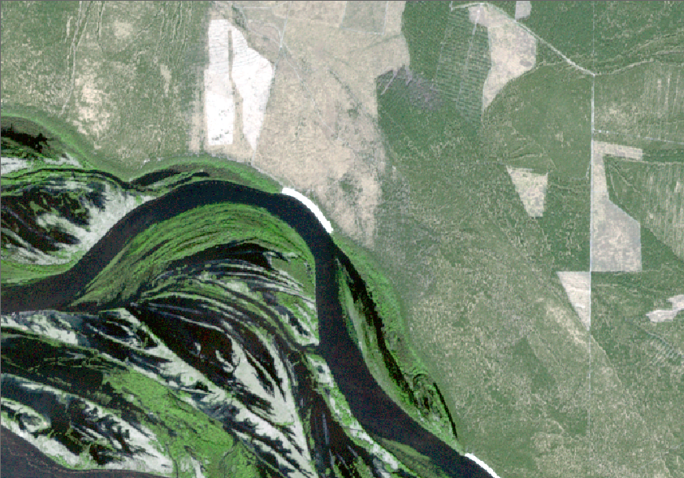

# geoalert_unify

a python package to combine raster bands into one image while reducing depth from 16-bit
to 8 bits.

# Installation

used as a python package 

# Usage

the package API defines only one method "get_rgb", used to construct the rgb image from 
three bands 
~~~py
from geoalert_unify import get_rgb
rgb(b1_path, b2_path, b3_path, output_file_path, output_file_name)
~~~

# Implementation

## class RastersIO

responsible for inputs (file reading), and output operations.

~~~bash
attributes:
---------
output_options (dict): holds all metadata of input bands (e.g. driver, crs, transform ..etc.).
rgb (numpy array): the output file image array.
first_input_path (str): path of the first band, used in case an output path is not given. 
~~~

## Methods

### get_rgb

~~~py
def get_rgb(self, b1_path : str = '', b2_path : str = '', b3_path : str = '') -> None:
~~~

get a stacked RGB image from 3 bands input,
calls RasterProcess constrcut_rgb method.

~~~ bash
args:
----
b1_path: str
path to the first band image(red band).
b2_path: str
path to the second band image(green band).
b3_path: str
path to the third band image(blue band).
~~~

### output_rgb

~~~py
def output_rgb(self, output_path : str, output_name : str) -> None:
~~~

writes the image to a tiff file via rasterio.

~~~ bash
args:
output_path: str
    path to which the file will be output,
    if it's not provided the path of the
    first band will be used.
output_name: str
    if the name of the output file,
    if it's not provided the default
    name would be "output".
~~~
## class RastersProcess

process the input bands and output one unified image - 8bits.

~~~bash
attributes:
---------
input_options(dict) : holds the metadata of input bands (e.g. driver, crs, transform ..etc.). 
~~~

## Methods

### construct_rgb

~~~py
def construct_rgb(self, b1_path : str = '', b2_path : str = '', b3_path : str = '') -> dict:
~~~

construct a stacked RGB image from 3 bands input,
returns ab object holds the unified image, and
input options of the bands (crs, transform ..etc.)

~~~bash
args:
----
b1_path: str
path to the first band image(red band).
b2_path: str
path to the second band image(green band).
b3_path: str
path to the third band image(blue band).
~~~

### get_band

~~~py
def get_band(self, b_path : str, b_name : str, img : dict)-> None:
~~~

reads the band via rasterio, calls 
scaleband method to scale down images 
from Unit16 to Unit8.

~~~bash
args:
----
b_path: str
    path to the band image.
b_name: str
    name of the band, used 
    to construct and img
    object that holds all
    bands of the image.
img: dict
    an object that holds all
    bands of the image.
~~~

### scale_band

~~~py
def scale_band(self,band)-> np.array:
~~~
scales 16-bit bands values
to 8-bit values (0-255) range,
returns a numpy array.

~~~bash
args:
----
band: np array
an array of numerical values
of the band image. 
~~~

### get_rgb

~~~py
def get_rgb(self, img:dict)-> np.array:
~~~

combine bands to one image using
numpy stack function.
returns numpy array.

~~~bash
args:
----
img: dict
    an object that holds three image 
    bands.
~~~
# Technical Description

## Workflow Description

the algorithm uses numpy stack method to construct the final rgb, a scaler is applied to map the 16-bit input bands to a 8-bit outputs by taking the maximum and minimum values and scales them to 255 and 0 respectivily 
## Technologies used

see requirements.py

## Results

